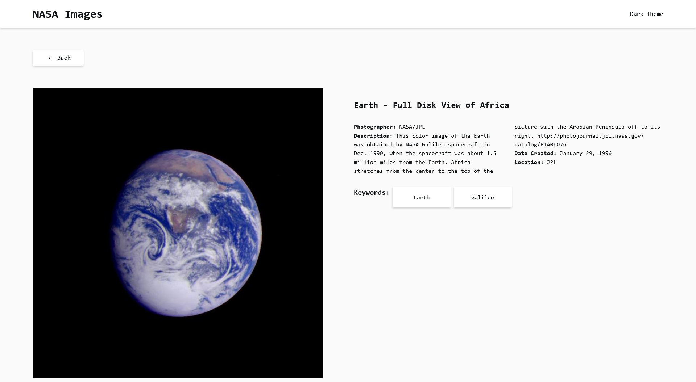

# NASA Images

This is a code challenge for Codekeeper.

- Single Page Application using `Vite` with `React` and `Typescript`;
- Uses `React Router` to create `/search` route and `/nasa_id/:nasa_id` route;
- It consumes the https://images-api.nasa.gov/search endpoint by `query input` and `time interval` of the image;
- It displays the thumbnail, title, location, and photographer's name on the home page;
- It gets a certain item from the collection by `nasa_id` and displays the title, location, photographer's name, description, keywords, date, and image;
- It toggles between `light` and `dark` themes;
- It comes with tests that covers the most important app logic.

## System Requirements

- Node.js
- npm

## Installation

1. Clone the repository to your local machine.
2. Navigate to the project directory.
3. Run `npm install` to install the project dependencies.

## Running the Project

- To start the development server, run `npm run dev`.
- To build the project, run `npm run build`.

## Running Tests

- To run the tests, use the command `npm run test`.

## Dependencies

This project uses several dependencies:

- `react` and `react-dom` for building the user interface.
- `react-router-dom` for routing.
- `swr` for remote data fetching.

## Dev Dependencies

This project uses several development dependencies:

- `@testing-library/jest-dom` and `@testing-library/react` for testing.
- `@types/react` and `@types/react-dom` for TypeScript definitions.
- `@typescript-eslint/eslint-plugin` and `@typescript-eslint/parser` for linting TypeScript.
- `@vitejs/plugin-react` for using React with Vite.
- `eslint` and `eslint-plugin-react-hooks` for linting JavaScript and React.
- `jsdom` for a JavaScript-based headless browser.
- `msw` for mocking a server.
- `typescript` for static types.
- `vite` for building and serving the app.
- `vitest` for testing with Vite.

Please refer to the `package.json` file for the specific versions of these dependencies.

## App Screenshots

Here are some screenshots of the app in different modes and pages:

|             Dark Mode              |              Light Mode              |
| :--------------------------------: | :----------------------------------: |
| ![Dark mode screenshot][dark_mode] | ![Light mode screenshot][light_mode] |

### Details Page

[dark_mode]: ./public/dark_mode.png "Dark mode screenshot"
[light_mode]: ./public/light_mode.png "Light mode screenshot"
